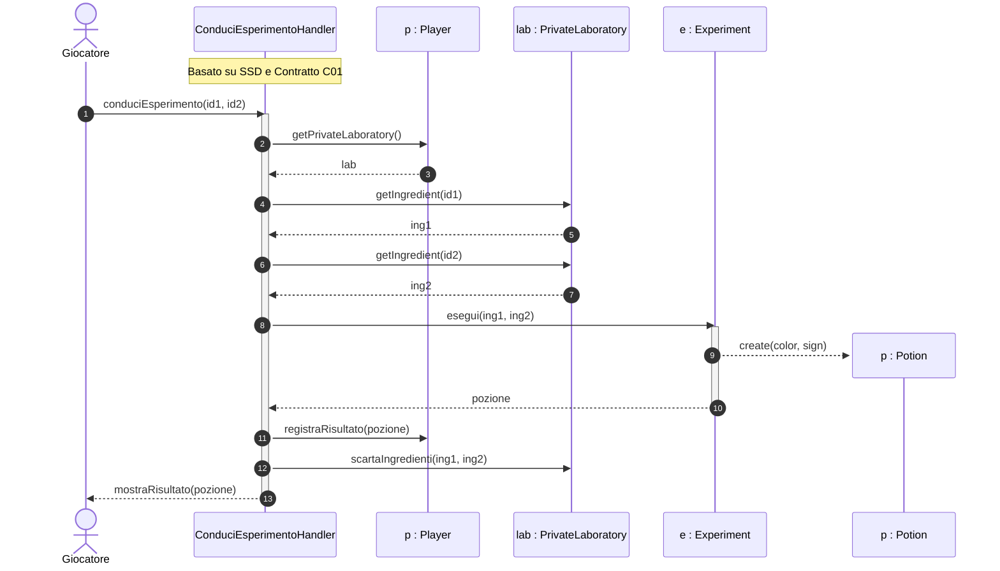

```mermaid

sequenceDiagram
    autonumber
    
    actor G as Giocatore
    participant H as ConduciEsperimentoHandler
    participant PLR as p : Player
    participant LAB as lab : PrivateLaboratory
    participant E as e : Experiment

    Note over H: Basato su SSD e Contratto C01

    %% Questa freccia DEVE avere i simboli > e non &gt;
    G->>H: conduciEsperimento(id1, id2)
    activate H

    %% Recupero ingredienti tramite associazione Player-Laboratory
    H->>PLR: getPrivateLaboratory()
    PLR-->>H: lab
    H->>LAB: getIngredient(id1)
    LAB-->>H: ing1
    H->>LAB: getIngredient(id2)
    LAB-->>H: ing2

    %% Esecuzione logica e creazione pozione
    H->>E: esegui(ing1, ing2)
    activate E
    
    %% Post-condizione C01: Creazione oggetto Potion
    create participant POT as p : Potion
    E-->>POT: create(color, sign)
    E-->>H: pozione
    deactivate E

    %% Registrazione risultati e scarto ingredienti
    H->>PLR: registraRisultato(pozione)
    H->>LAB: scartaIngredienti(ing1, ing2)

    H-->>G: mostraRisultato(pozione)
    deactivate H

```